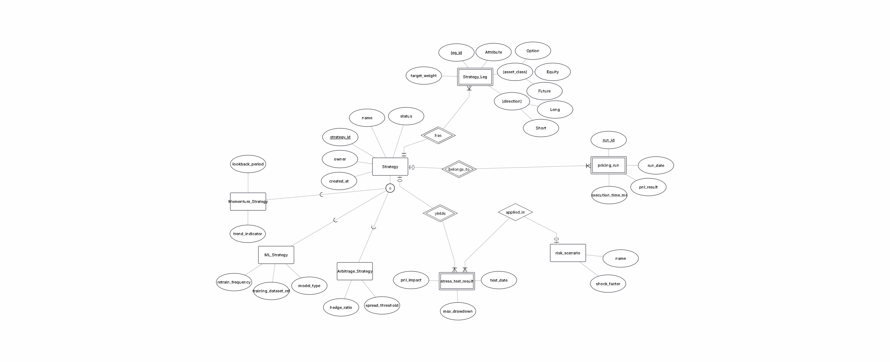

# Data Model Draft

## EER diagram

## Core entities
### Strategy (base)
- id
- name
- created_at

### MomentumStrategy (subtype)
- id (PK, FK to Strategy)

### MLStrategy (subtype)
- id (PK, FK to Strategy)

### ArbitrageStrategy (subtype)
- id (PK, FK to Strategy)

### StrategyLeg (weak entity)
- id
- strategy_id (FK to Strategy)
- name
- created_at

### PricingRun
- id
- strategy_id (FK to Strategy)
- created_at

### RiskScenario
- id
- name
- created_at

### StressTestResult (associative entity)
- id
- strategy_id (FK to Strategy)
- risk_scenario_id (FK to RiskScenario)
- created_at

## Relationships and constraints
- Strategy specialization is total and disjoint: every Strategy is exactly one of Momentum, ML, or Arbitrage.
- Implementation detail: `strategy_kind` on Strategy acts as a discriminator to enforce the subtype.
- Strategy -> StrategyLeg is 1:N with mandatory participation on both sides (a strategy must have at least one leg).
- Strategy -> PricingRun is 1:N with optional participation on Strategy, mandatory on PricingRun.
- Strategy -> StressTestResult is 1:N with optional participation on Strategy, mandatory on StressTestResult.
- RiskScenario -> StressTestResult is 1:N with optional participation on RiskScenario, mandatory on StressTestResult.

## Future entities (placeholders)
- MarketDataSnapshot
- MonteCarloJob
